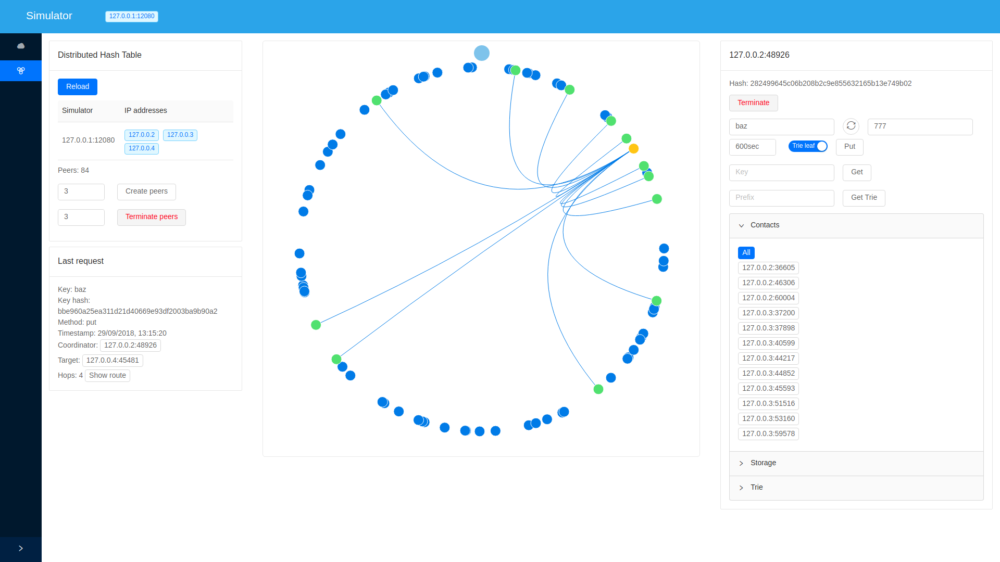

# party-bus

Implementation of some distributed systems and
a simulator for visualising and testing them.

## Implementations
- Distributed Hash Table (DHT) over UDP.
- Distributed Trie over DHT.
- Point-to-Point Protocol over TCP.
- Gossip protocol for discovering TCP endpoints.
- Distributed Actors (Erlang-style processes) with mailboxes, selective receive, group registration and monitoring.
- Simple backpressure between actors.
- Basic Paxos using actors.
- Leader election using Basic Paxos.
- Simple persistent transactional key-value storage.
- Stream replication for the key-value storage.
- Fencing token for configuring replication between leaders and followers.

Copyright © 2017-2019 Vladyslav Lopalo

